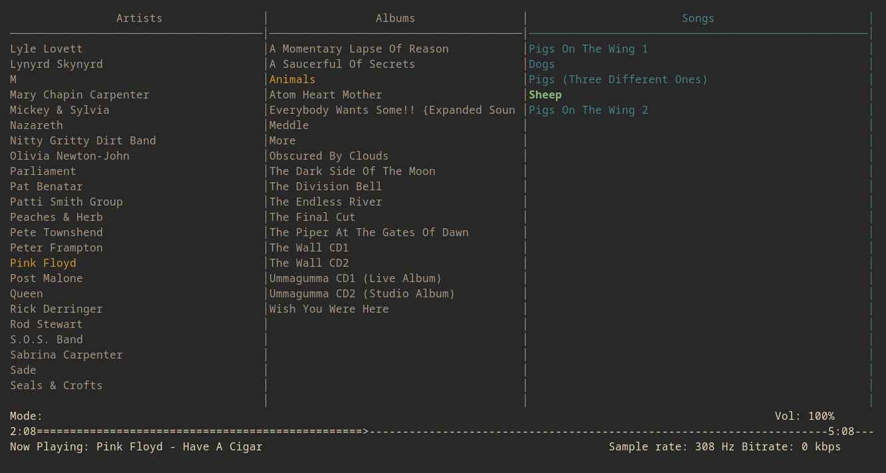

# sheep - Simple MPD Client

## About

sheep is a minimal MPD (Music Player Daemon) client inspired by the suckless philosophy. The name "sheep" is a nod to Pink Floyd's iconic song "Sheep" from their 1977 album "Animals".

## Dependencies

Before building sheep, ensure you have the following dependencies installed:

### Debian/Ubuntu
sudo apt-get install libncurses5-dev libmpdclient-dev

### Fedora
sudo dnf install ncurses-devel libmpdclient-devel

### Arch Linux
sudo pacman -S ncurses libmpdclient

### macOS (using Homebrew)
brew install ncurses libmpdclient

## Installation
git clone https://github.com/malcolmreed-ent/sheep.git
cd sheep
make
sudo make install

## Uninstallation
cd sheep
sudo make uninstall

## Usage
To start sheep, simply run:
sheep

sheep provides a three-column interface displaying artists, albums, and songs. Use the arrow keys or h/j/k/l to navigate, Enter to select, and Space to play/pause.

## Configuration

Edit `config.h` to customize sheep to your liking. You can modify keybindings, colors, and other display options.

## Keybindings

| Key | Action |
|-----|--------|
| q   | Quit   |
| h/Left | Move to left column |
| l/Right | Move to right column |
| k/Up | Move selection up |
| j/Down | Move selection down |
| Enter | Select item / Play song |
| Space | Play/Pause |
| < | Previous track |
| > | Next track |
| + | Volume up |
| - | Volume down |
| f | Seek forward |
| b | Seek backward |
| a | Add selected song to queue |
| C | Clear queue |
| r | Toggle repeat |
| z | Toggle random |
| s | Toggle single |
| c | Toggle consume |
| / | Search |
| R | Refresh library |
| ? | Show help |

## Features

- Minimal and efficient MPD client
- Easy to configure and customize
- Three-column interface for browsing artists, albums, and songs
- Real-time search functionality
- Playback controls including seek and volume adjustment
- Queue management
- Playback mode toggles (repeat, random, single, consume)

## Contributing

Contributions to sheep are welcome. Please feel free to submit a Pull Request.

## License

sheep is released under the MIT License. See the LICENSE file for more details.

## TODO

- Add support for playlists
- Implement a configuration file for persistent settings (somewhat finished via config.h)
- Add album art display support
- Improve error handling and user feedback

## Bugs

If you encounter any bugs or issues, please report them on the [GitHub Issues page](https://github.com/malcolmreed-ent/sheep/issues).

When reporting a bug, please include:
- Your operating system and version
- Your MPD version
- Steps to reproduce the bug
- Expected behavior
- Actual behavior
